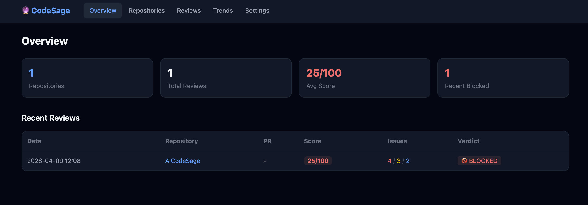
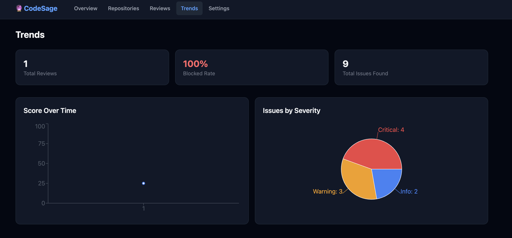

# CodeSage Dashboard

[English](README.md) | [中文](README.zh-CN.md)

[CodeSage](https://github.com/Louis-XWB/CodeSage) 的可视化面板 — 查看 AI 代码审查历史、追踪代码质量趋势、监控仓库状态。

## 截图

### 总览


### 趋势分析


## 功能

- **总览** — 汇总卡片、最近审查一览
- **仓库列表** — 所有审查过的仓库，显示平均分和审查次数
- **仓库详情** — 评分趋势图、问题分类、PR 审查历史
- **审查列表** — 所有审查记录，支持筛选
- **审查详情** — 完整报告，包含问题、commit 信息、修复建议
- **趋势分析** — 评分走势、问题严重度分布、阻断率
- **设置** — 配置 API 地址

## 快速开始

### 前置要求

- Node.js >= 18
- [CodeSage](https://github.com/Louis-XWB/CodeSage) 服务运行中（提供 REST API）

### 安装运行

```bash
git clone https://github.com/Louis-XWB/CodeSage-Dashboard.git
cd CodeSage-Dashboard
pnpm install
pnpm dev
```

打开 http://localhost:5173

### API 连接

Dashboard 默认连接 `http://localhost:3000` 的 CodeSage 服务。

修改方式：
- **构建时：** 设置 `VITE_API_URL` 环境变量
- **运行时：** 在 Dashboard 的设置页面修改

### 启动 CodeSage 服务

Dashboard 需要 CodeSage 服务提供数据：

```bash
# 在 CodeSage 项目目录
codesage server --port 3000
```

## 技术栈

- React 18 + TypeScript
- Vite
- Tailwind CSS
- Recharts
- React Router

## 构建部署

```bash
pnpm build
```

产物在 `dist/` 目录，部署到任何静态文件服务器（nginx、Vercel 等）即可。

## 许可证

MIT
